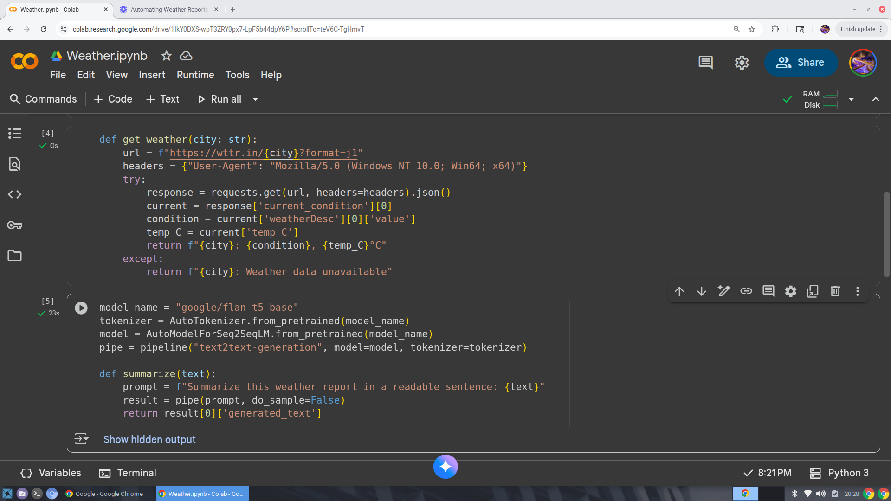
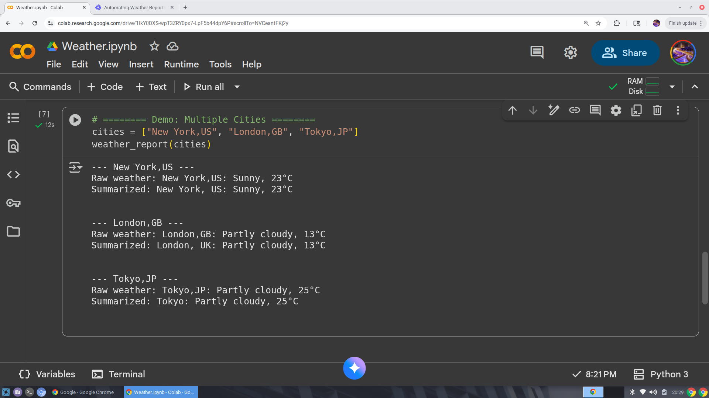

# API-Powered Weather Agent

This project demonstrates an AI agent that fetches live weather data and summarizes it using a language model (FLAN-T5).  
It integrates **live API calls** with **LLM summarization** to provide clear, readable weather reports for multiple cities.

---

## Model & Functions

The agent combines the weather-fetching function and the summarization pipeline:

- `get_weather(city)` — fetches live weather data from wttr.in  
- `summarize(text)` — uses FLAN-T5 to generate a readable summary  

---

## Example Run

The agent fetches weather for multiple cities and produces both raw and summarized outputs.

---

## Demo Video

Watch the agent in action:  
[Weather Agent Demo Video](https://www.loom.com/share/d9be07fc28ef455b83bcb5e945f89f29?sid=90e1293a-c898-45f9-8a7c-ac058e39b941)

---

## How It Works

1. **Fetch Weather:** Uses the wttr.in API for live data.  
2. **Summarize:** Passes the raw weather data to the FLAN-T5 model through a pipeline.  
3. **Output:** Prints both raw and summarized weather for each city in a readable format.

---

## Dependencies

- `transformers`  
- `accelerate`  
- `langchain`  
- `langchain_community` (if used)  
- `requests`  

> All dependencies are included in the notebook. Run the cells sequentially to replicate results.

---

## Portfolio Notes
 
- Building autonomous API-powered agents  
- Integrating real-world APIs with LLMs  
- Summarizing and presenting data clearly
